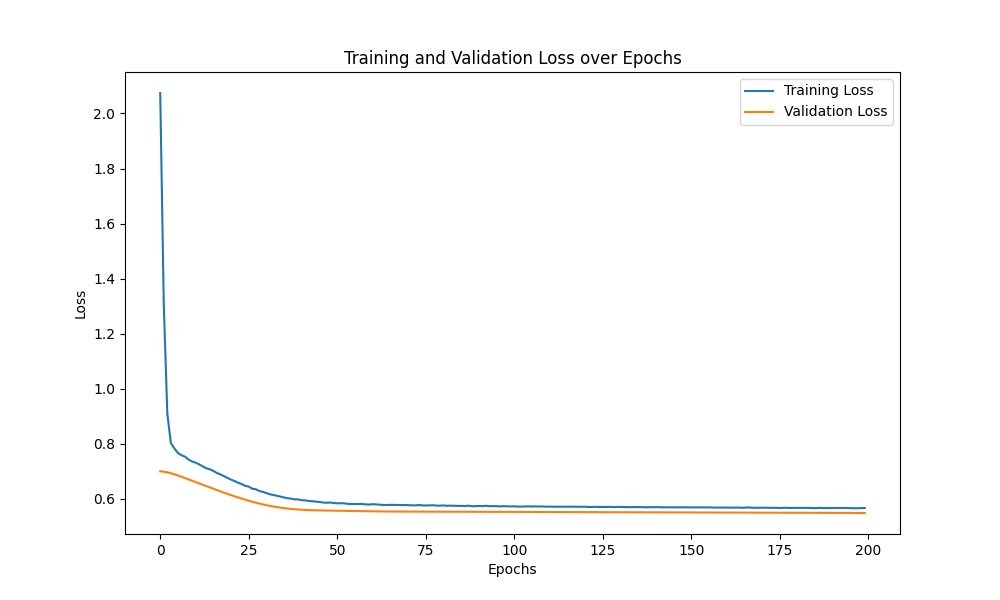

```markdown
# GAT Research: Graph Attention Networks

This repository provides a clean, reproducible implementation of [Graph Attention Networks (Veličković et al., 2017)](https://arxiv.org/abs/1710.10903) using PyTorch Geometric.

---

## Setup

### 1. Prerequisites
- **Python:** 3.12.2
- **Package Manager:** [uv](https://github.com/astral-sh/uv)
- **Hardware:** NVIDIA GPU with CUDA 11.8 support (e.g., GTX 1080)

### 2. Installation
```bash
# Sync dependencies and create virtual environment
uv sync
source .venv/bin/activate
```

### Training
# Run training on a specific dataset
python src/main.py --dataset PPI


## Datasets

The models are evaluated on standard citation networks and inductive protein-protein interaction graphs. All datasets are automatically downloaded via PyTorch Geometric.

| Dataset | Nodes | Edges | Features | Classes | Task Type |
| --- | --- | --- | --- | --- | --- |
| **Cora** | 2,708 | 10,556 | 1,433 | 7 | Transductive |
| **CiteSeer** | 3,327 | 9,104 | 3,703 | 6 | Transductive |
| **PubMed** | 19,717 | 88,648 | 500 | 3 | Transductive |
| **PPI** | 56,944 | 1,612,348 | 50 | 121 | Inductive (Multi-label) |


## Benchmarks

Results obtained using the current implementation. Note that PPI performance indicates a need for further hyperparameter tuning or multi-head optimization.

| Dataset | Task Type | Metric | Value | Original GAT |
| --- | --- | --- | --- | --- |
| Cora | Transductive | Accuracy | 0.800 | 0.830 |
| CiteSeer | Transductive | Accuracy | 0.670 | 0.725 |
| PubMed | Transductive | Accuracy | 0.770 | 0.790 |
| PPI | Inductive | Micro-F1 | 0.395 | 0.973 |

---

### Training Dynamics

#### Cora


#### CiteSeer


#### PubMed


#### PPI

---
