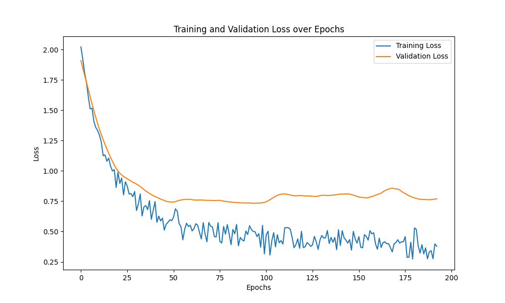
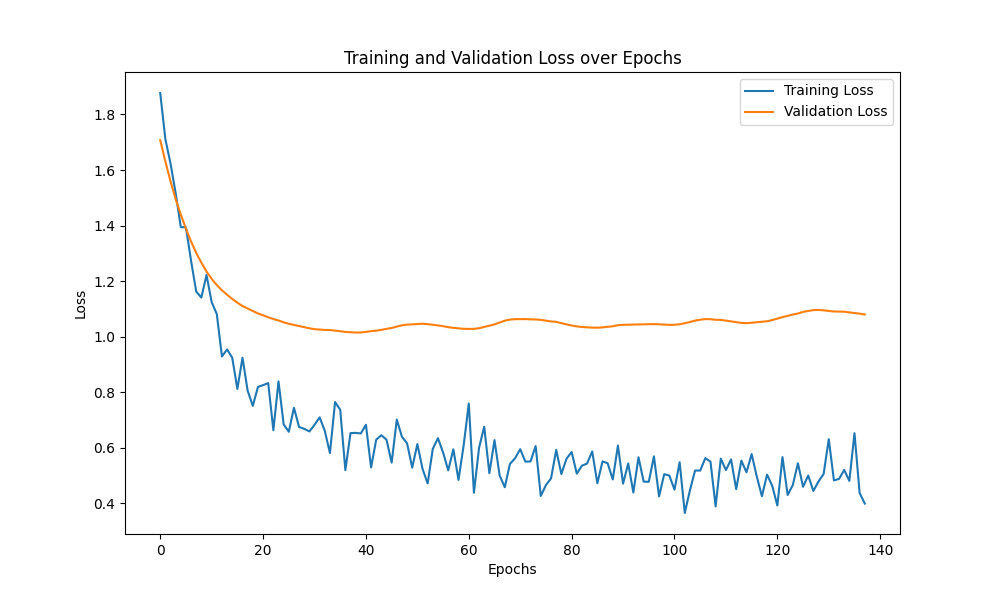
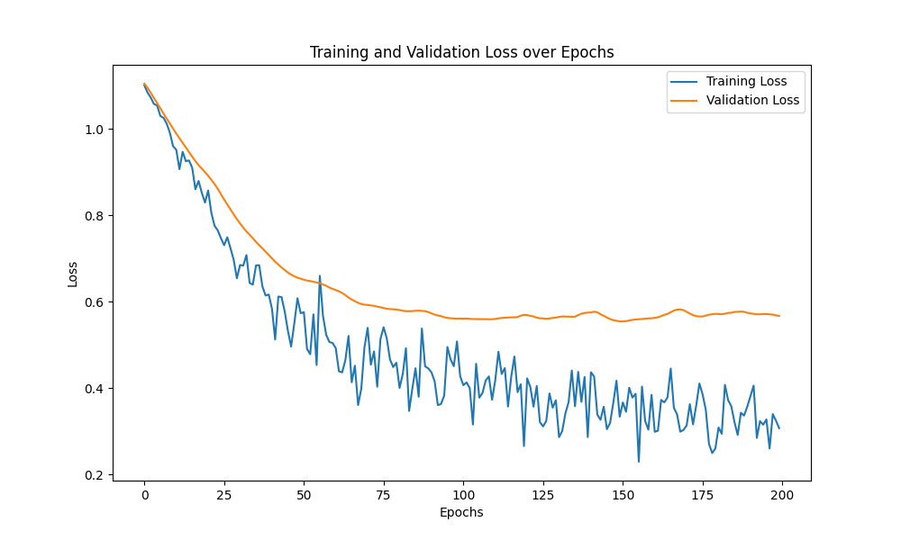

### GAT GNN Implementation

The project tries to reimplement the concepts presented in the original GAT paper: [Graph Attention Networks](https://arxiv.org/abs/1710.10903) using PyTorch Geometric library.

### Datasets

The project uses standard transductive 
- [Cora](https://linqs.soe.ucsc.edu/data)
- [CiteSeer](https://linqs.soe.ucsc.edu/data)
- [PubMed](https://linqs.soe.ucsc.edu/data)

and the inductive node classification datasets from PyTorch Geometric used in the original paper:
- [PPI](https://arxiv.org/abs/1707.04638) dataset used in the original paper for node classification tasks.

### Results
Cora dataset:
- Test Accuracy: 0.8

CiteSeer dataset:
- Test Accuracy: 0.67

PubMed dataset:
- Test Accuracy: 0.77

PPI dataset:
- Test F1 Score: ~0.395

