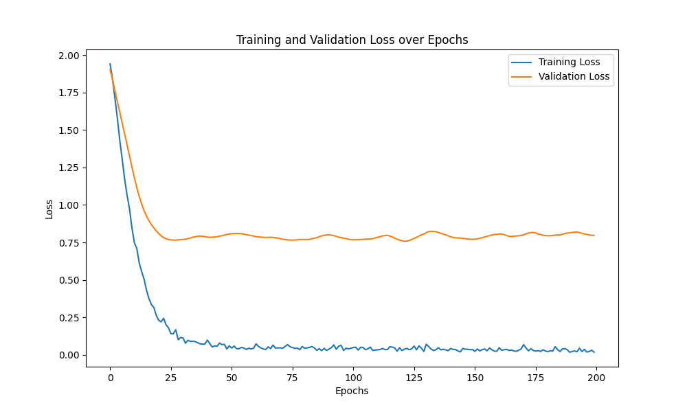
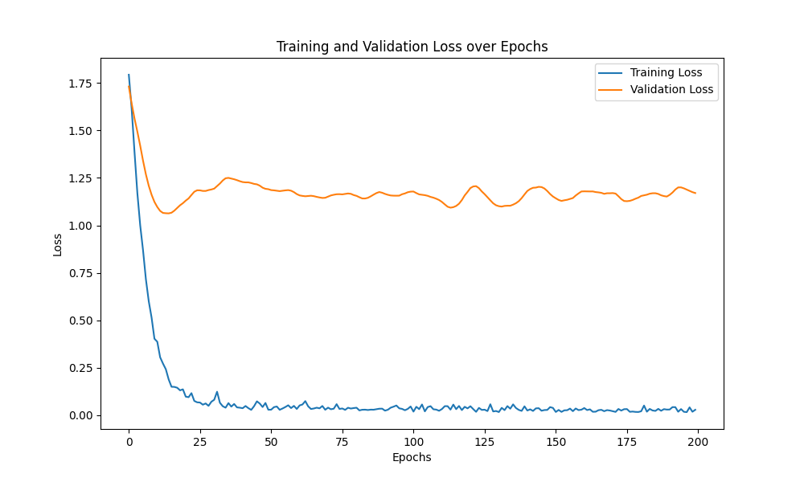
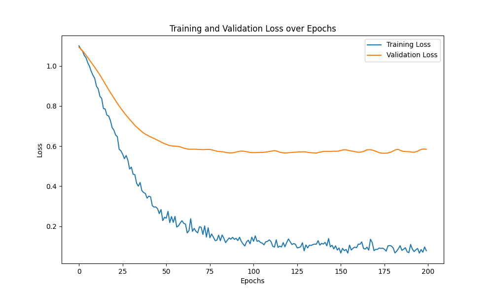

### Graph-Convolution Network (GCN) for Node Classification

This repository contains an implementation of a Graph-Convolution Network (GCN) for node classification tasks using PyTorch and PyTorch Geometric. The project tries to reimplement 
the original GCN model proposed by Kipf and Welling in their paper [Semi-Supervised Classification with Graph Convolutional Networks](https://arxiv.org/abs/1609.02907).

### Datasets

The implementation supports popular graph datasets such as Cora, Citeseer, and Pubmed, which can be easily loaded using PyTorch Geometric's dataset utilities.

### Results

Cora
- Accuracy: 81.5%

Citeseer
- Accuracy: 70.3%

Pubmed
- Accuracy: 79.0%

