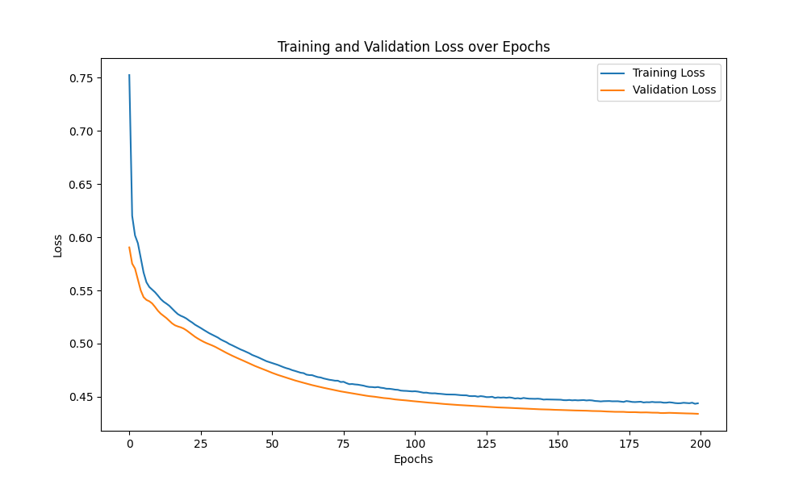

### Graph-SAGE GNN Implementation

The project tries to reimplement the concepts presented in the original Graph-SAGE paper: [Inductive Representation Learning on Large Graphs](https://arxiv.org/abs/1706.02216) using PyTorch Geometric library.

### Datasets

The project uses standard [PPI](https://arxiv.org/abs/1707.04638) dataset used in the original paper for node classification tasks.

### Results
- Micro-F1: 0.6043

